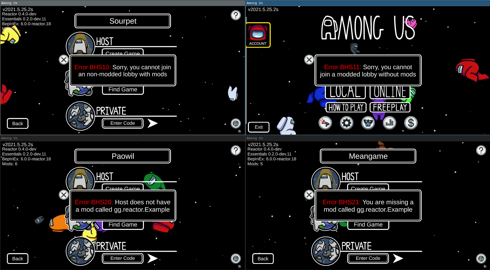

# Boot.Handshake

Boot.Handshake is an [Impostor](https://github.com/Impostor/Impostor) plugin that deals with the Reactor handshake. It compares the list of mods installed and prevents people from joining lobbies with the wrong set of mods.

## Installation

To install the plugin, you need [Impostor](https://github.com/Impostor/Impostor) 1.4 build 188 or newer, which can be obtained from AppVeyor.

Download `Boot.Handshake.dll` from the [Github Releases](https://github.com/miniduikboot/Boot.Handshake/releases) and put it in your `plugins` folder.

Boot.Handshake cannot be configured. You should see a message in Impostor's log that confirms the plugin was enabled.

## Usage

When connecting, you may encounter one of the following errors:

### BHS01 Mod already registered

You have two mods installed with the same id. Delete one of them and restart your game.

If you are a mod developer, make sure your Mod's ID is unique: it is recommended to use a reverse domain name followed by the name of your mod. For example, this plugin identifies itself as `at.duikbo.handshake` because my domain is `duikbo.at` and this plugin implements the `handshake`.

### BHS10 Sorry, you cannot join an non-modded lobby with mods

The people you are playing with are not using mods. If you still want to play with them, deinstall your mods and restart your game.

### BHS11 Sorry, you cannot join a modded lobby without mods

Your client does not have mods installed. Check in the left hand corner of your screen if there is a line containing `Reactor` under the version number (See the Showcase section if you don't know how this looks)

If there is such a line, your client is not sending a handshake. Please contact miniduikboot to figure this out.

If there is no such line, your mods are not activated. Check the [Reactor install guide](https://docs.reactor.gg) to install [BepInEx](https://docs.reactor.gg/docs/basic/install_bepinex) and [Reactor](https://docs.reactor.gg/docs/basic/install_reactor).

### BHS20 Host does not have a mod called X

You have a mod installed that the host doesn't have and as a result you cannot join this game. Remove this mod and restart your game.

### BHS21 You are missing a mod called X

You do not have a mod installed that the other people in the room are playing with. Install this mod and restart your game.

### BSH22 Version mismatch

One of your mods has a different version compared to that of the host. Update your copy of the mod or tell the other players to update their copy.

### BSH31 Unregistered mod X cannot send Custom RPC's

### Other error codes (BHS02, BHS03, BHS30)

These error codes shouldn't occur and indicate a bug in your client's implementation of the protocol. Contact miniduikboot if you need help with this error code.

## Showcase

